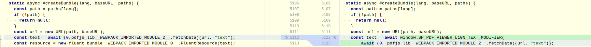
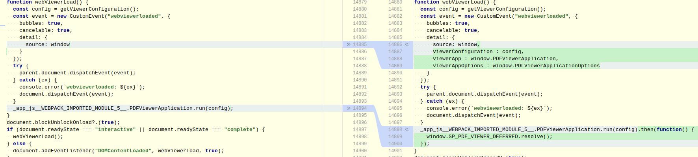

# Updating PDF.JS plugin

Updating PDF.JS means a bit of work.

1. First thing is
   to [download the new version](https://mozilla.github.io/pdf.js/getting_started/#download).
2. Renaming some source names. All `.mjs` have to be renamed into `.min.js` in order to be provided
   rightly by the application server. Setting `.min` part into file name avoid the minification of
   the file.
3. Removing all `.map` files.
4. Copying `js` from `build` folder to the Silverpeas's `core` one.
5. Adapting `viewer.jsp` content with the new `viewer.html` one:
    * first, it consists into copying exactly the body HTML element;
    * then the `<script>` content must be adapted.
6. The previous action induces some manual modifications to perform on `viewer.min.js` file. 

As requested by the plugin authors, `Please re-skin it or build upon it`, the viewer has already
been re-skinned. Perhaps some additional CSS instructions should be adapted into `sp-viewer.css`
file. For specific skinning, `sp-viewer-addon.css` file can be filled (empty by default).

Let's follow what's been adapted for updates.

## From 2.2.228 to 4.0.379

This represents a considerable gap.

### L10N management

This new version is now using plugin of [Fluent Project](https://projectfluent.org).
It consists into getting the translation text content (into [Fluent syntax](https://projectfluent.org/fluent/guide/index.html)) from `locale.json` locale mapping.

For Silverpeas's implementation, some translations must be modified, and some must be added (
from `viewerBundle.properties`). In this aim, `window.SP_PDF_VIEWER_L10N_TEXT_MODIFIER(text)`
function is implemented into `viewer.jsp`. It is responsible to complete the given translation text.
The function is wired into `viewer.min.js`:

The result of the method returning `text` value MUST be given
to `window.SP_PDF_VIEWER_L10N_TEXT_MODIFIER(text)` method to get the final l10n text source.

### Viewer starting

The viewer starting is perform by `webViewerLoad` method of `viewer.min.js` source. Two phases can be inside identified:

1. dispatching a custom event `webviewerloaded` just after reading the viewer configuration (mainly
   identifying all the DOM containers)
2. running the configuration (means starting the display of the viewer)

To add Silverpeas's functionalities, it is needed to change some stuffs of the read configuration
(phase 1), but also it is needed to add/change some viewer behavior after it has started (after
phase 2).

Custom event detail is completed with needed instances. After the viewer has started, a Silverpeas's
promise is resolved to indicates that behavior to implement after the viewer start can be added.

### viewer.jsp

This is the Silverpeas page responsible for starting and configuring the PDF viewer according to the
user's context. Please consult GIT history on the file to identify all the modifications performed
into `<script>` module.

## From 4.0.379 to 6.3.289

Another considerable gap. The two manual modifications of `viewer.min.js` described above are still
required, at the very same places (`GenericL10n.#createBundle` for the L10N one, `webViewerLoad` for
the viewer starting one). Beware that the upstream `webViewerLoad` now provides only `source` into
the custom event detail.

### New resource folders

Two folders have to be copied in addition to the previous ones: `wasm` (JBIG2/OpenJPEG/QCMS decoders
and the QuickJS sandbox used by the PDF scripting) and `iccs` (ICC color profiles). Their location,
as the one of `standard_fonts`, is given to the viewer through new `PdfViewerSettings` entries
(`p.wa.p`, `p.ic.p` and `p.s.f.p`) set by `JavascriptPluginInclusion#includePdfViewer`, and then
applied as the `wasmUrl`, `iccUrl` and `standardFontDataUrl` viewer options. Without them the viewer
resolves those paths relatively to `viewer.jsp` and fails to fetch them.

### HTML restructuring

The whole markup of the toolbars has been reworked:

* the left sidebar (`#sidebarContainer`, `#toolbarSidebar`, `#sidebarContent`, `#thumbnailView`, …)
  is replaced by the *views manager* (`#viewsManager`, `#viewsManagerContent`, `#thumbnailsView`, …)
  which is now nested into `#toolbarViewerLeft`;
* most of the buttons have been renamed with a `Button` suffix (`#viewFind` → `#viewFindButton`,
  `#zoomOut` → `#zoomOutButton`, `#print` → `#printButton`, `#download` → `#downloadButton`,
  `#secondaryToolbarToggle` → `#secondaryToolbarToggleButton`, …), the former identifier being now
  the one of the wrapping `div.toolbarButtonWithContainer`;
* the editor buttons are each wrapped with their own parameters toolbar into
  `#editorModeButtons`;
* `#viewer-alert`, `#editorUndoBar` and the signature/comment dialogs are new;
* `#fileInput` has been dropped, the viewer creates it by itself.

`sp-viewer.css` has been adapted accordingly.

### Hiding the edition tools

Removing the editor buttons one by one from the viewer configuration isn't necessary anymore: the
`annotationEditorMode` option set to `-1` (`AnnotationEditorType.DISABLE`) makes the viewer hide
`#editorModeButtons` and `#editorModeSeparator` by itself.

### L10N locale

The `locale` viewer option has been replaced by `localeProperties`, an object whose `lang` property
carries the language.

